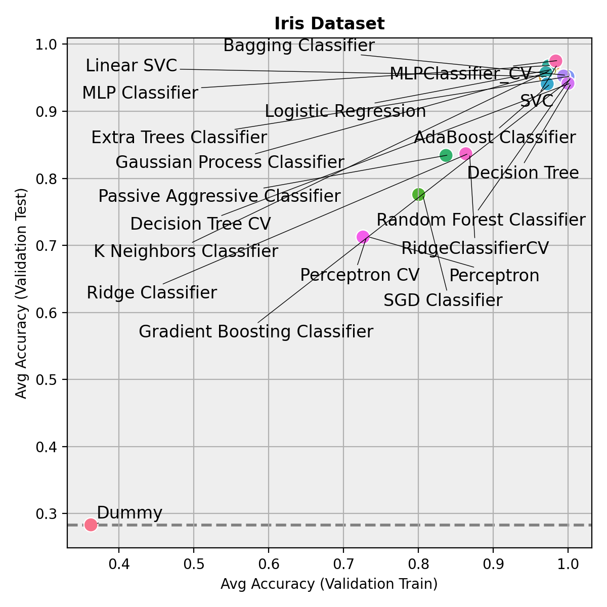
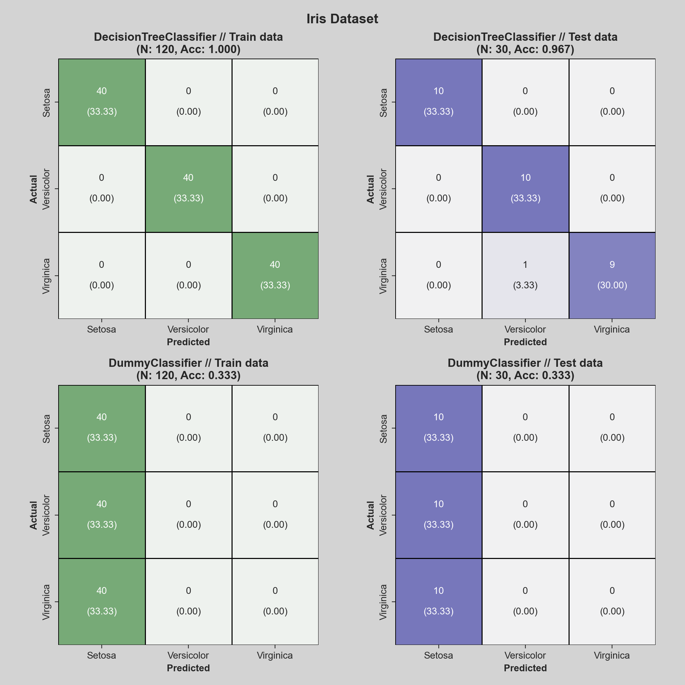
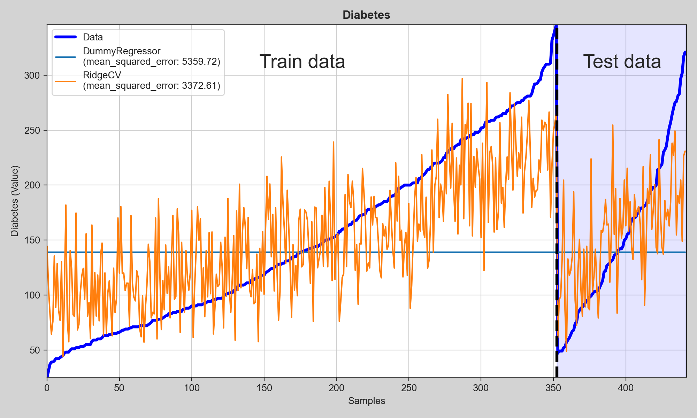

# Hundred Hammers

*Hundred Hammers* is a Python package that helps you batch-test ML models in a dataset. It can be used out-of-the-box
to run most popular ML models and metrics, or it can be easily extended to include your own.

Includes:

- Supports both classification and regression.
- Already comes strapped with most sci-kit learn models.
- Already comes with several plots to visualize the results.
- Easy to integrate with parameter tuning from GridSearch CV.
- For each metric, calculates the mean and std. deviation for training, test, validation (train) and validation (test) sets.
- Produces a Pandas DataFrame with the results (which can be exported to CSV and analyzed elsewhere).

## Installation

Clone the repository and run `pip install .` in the root directory. 

## Examples

Full examples can be found in the `test` directory. Here's a simple example of how to use Hundred Hammers to run a
batch classification on Iris data:

```python
from hundred_hammers.classifier import HundredHammersClassifier
from hundred_hammers.plots import plot_batch_results
from sklearn.datasets import load_iris

data = load_iris()
X, y = data.data, data.target

hh = HundredHammersClassifier()
df_results = hh.evaluate(X, y)

plot_batch_results(df_results, metric_name="Accuracy", title="Iris Dataset")
```

This already gives us a DataFrame with the results from several different models, and a nice plot of the results:

<div style="width: 60%">

</div>

We can also use Hundred Hammers to produce nice confusion matrices plots and regression predictions:

```python
from hundred_hammers.plots import plot_confusion_matrix

plot_confusion_matrix(X, y, class_dict={0: "Setosa", 1: "Versicolor", 2: "Virginica"},
                      model=DecisionTreeClassifier(), title="Iris Dataset")
```

<div style="width: 60%">

</div>

```python
from hundred_hammers.plots import plot_regression_pred

plot_regression_pred(X, y, models=[DummyRegressor(strategy='median'), best_model], metric=mean_squared_error,
                     title="Diabetes", y_label="Diabetes (Value)")
```

<div style="width: 60%">

</div>